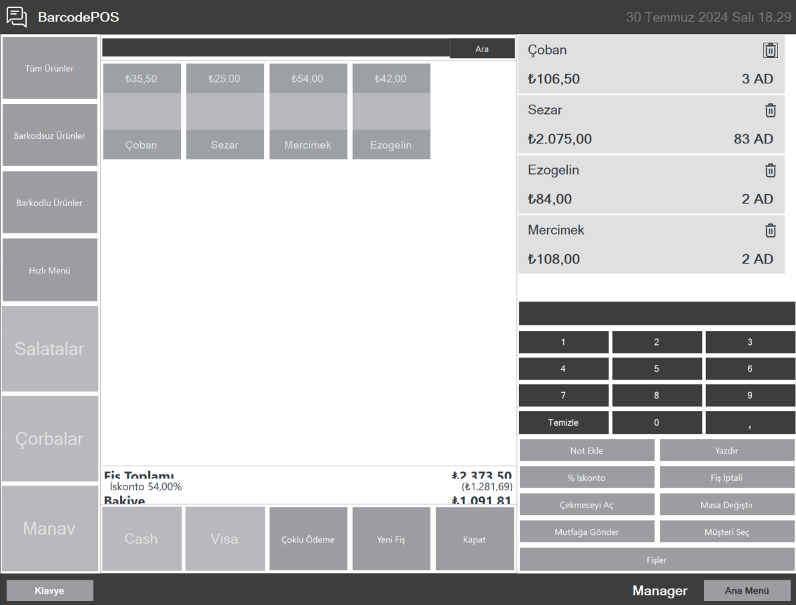

# BarcodePOS

## About

`BarcodePOS` is a Point of Sale (POS) system developed using WinForms. It integrates barcode scanning, weighing scale, and printer functionalities to provide a complete solution for retail and sales environments.

## Screenshot


## Features

- **Barcode Scanning**: Supports barcode scanning for quick and accurate item entry.
- **Scale Integration**: Connects to a weighing scale to manage product weights and prices.
- **Printer Integration**: Provides functionality to print receipts and other relevant documents.
- **User-Friendly Interface**: Easy-to-use interface designed for efficient POS operations.

## Technologies Used

- **C# WinForms**: Framework for creating the desktop application interface.
- **.NET Framework/Core**: Backend logic and operations.
- **Barcode Scanners**: Hardware integration for barcode reading.
- **Weighing Scales**: Hardware integration for weight measurement.
- **Printers**: Hardware integration for printing receipts.

## Installation

1. **Clone the Repository**:
    ```sh
    git clone https://github.com/BeratARPA/BarcodePOS.git
    ```
2. **Open with Visual Studio**: Open the project in Visual Studio.
3. **Install Dependencies**: Ensure all necessary dependencies are resolved.
4. **Configure Hardware**: Set up and connect the barcode scanner, weighing scale, and printer.
5. **Build the Project**: Build the solution to ensure proper setup.
6. **Run the Project**: Press F5 to run the project and access the POS system.

## Usage

1. **Launch the Application**: Start the application from Visual Studio or the executable.
2. **Scan Barcodes**: Use the barcode scanner to add items to the transaction.
3. **Weigh Products**: Use the scale to weigh products and manage pricing.
4. **Print Receipts**: Print receipts using the connected printer.
5. **Manage Transactions**: Handle sales transactions and generate reports as needed.

## Contributing

If you would like to contribute, please fork the repository, create a feature branch, and submit a pull request.

## License

This project is licensed under the MIT License. See the [LICENSE](LICENSE) file for more details.

## Contact

For questions or feedback, feel free to contact me:
- **Email**: [beratarpa@hotmail.com](mailto:beratarpa@hotmail.com)
- **GitHub**: [https://github.com/BeratARPA](https://github.com/BeratARPA)
